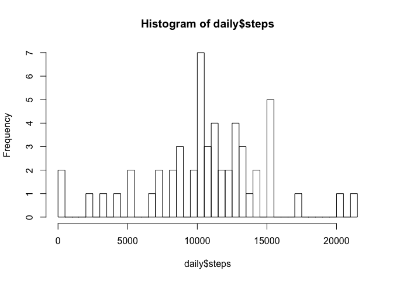
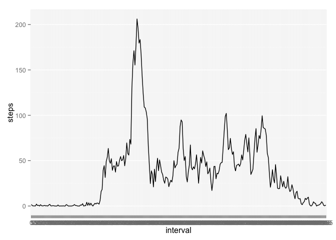
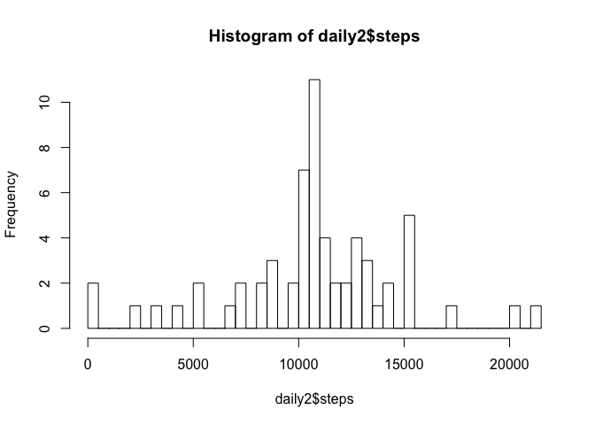
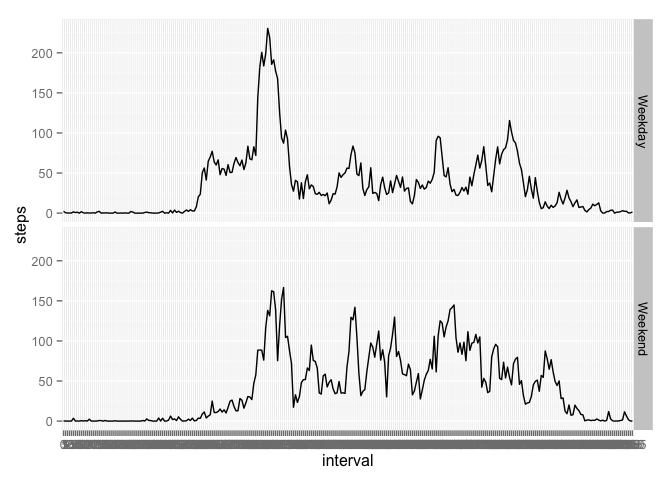

# Reproducible Research: Peer Assessment 1

## Loading and preprocessing the data


```r
setwd("/Users/christinabrady/Documents/Coursera courses/Data Science Specialization/Reproducible Research/RepData_PeerAssessment1")
library(ggplot2)
activity <- read.csv("activity.csv")
activity$date <- as.Date(activity$date)
activity$interval <- as.factor(activity$interval)
```
## What is mean total number of steps taken per day?


```r
daily <- aggregate(steps~date, data=activity, sum)
hist(daily$steps, breaks=50)
```

 

```r
summary(daily$steps)
```

```
##    Min. 1st Qu.  Median    Mean 3rd Qu.    Max. 
##      41    8840   10800   10800   13300   21200
```
The mean and median total number of steps taken per day are 10770 and 10760 respectively. This accords with what the histogram shows. 

## What is the average daily activity pattern?

```r
intervals <- aggregate(steps~interval, data=activity, mean)
i <- ggplot(intervals, aes(x=interval, y=steps, group=1)) + geom_line()
i
```

 

```r
intervals[which.max(intervals$steps),]
```

```
##     interval steps
## 104      835 206.2
```
The interval 835 contains the most steps on average across all of the days at 206.1698 steps.

## Imputing missing values

```r
summary(activity)
```

```
##      steps            date               interval    
##  Min.   :  0.0   Min.   :2012-10-01   0      :   61  
##  1st Qu.:  0.0   1st Qu.:2012-10-16   5      :   61  
##  Median :  0.0   Median :2012-10-31   10     :   61  
##  Mean   : 37.4   Mean   :2012-10-31   15     :   61  
##  3rd Qu.: 12.0   3rd Qu.:2012-11-15   20     :   61  
##  Max.   :806.0   Max.   :2012-11-30   25     :   61  
##  NA's   :2304                         (Other):17202
```
There are 2304 NAs in the entire data set. Since the number of steps varies greatly over the course of a day, I will use the mean of the corresponding 5 minute interval across all days to impute the NA values. 

```r
colnames(intervals) <- c("interval", "imputed.steps")
ai <- merge(activity, intervals)
ai$steps[is.na(ai$steps)] <- ai$imputed.steps[is.na(ai$steps)]
ai <- ai[order(ai[,3], ai[,1]),]
head(ai)
```

```
##       interval   steps       date imputed.steps
## 1            0 1.71698 2012-10-01       1.71698
## 13727        5 0.33962 2012-10-01       0.33962
## 67          10 0.13208 2012-10-01       0.13208
## 4414        15 0.15094 2012-10-01       0.15094
## 8255        20 0.07547 2012-10-01       0.07547
## 11856       25 2.09434 2012-10-01       2.09434
```

Imputing the missing values based on the mean number of steps taken in each interval does not change the mean number of steps taken in one day. It does change the median by 10 steps, though. 

```r
daily2 <- aggregate(steps~date, data=ai, sum)
hist(daily2$steps, breaks=50)
```

 

```r
summary(daily2$steps)
```

```
##    Min. 1st Qu.  Median    Mean 3rd Qu.    Max. 
##      41    9820   10800   10800   12800   21200
```

## Are there differences in activity patterns between weekdays and weekends?
The activity patterns for weekdays and weekends do differ. Mean activity increases rapidly on weekdays

```r
ai$day <- weekdays(as.Date(ai$date))
day <- c("Monday", "Tuesday", "Wednesday", "Thursday", "Friday", "Saturday", "Sunday")
day.type <- c(rep("Weekday", 5), rep("Weekend", 2))
d <- data.frame(day=day, day.type=day.type)
ai2 <- merge(ai, d)
ai2$day.type <- as.factor(ai2$day.type)
ai3 <- aggregate(steps~day.type+interval, data=ai2, mean)
dplot <- ggplot(ai3, aes(x=interval, y=steps, group=1)) +geom_line() + facet_grid(day.type~.)
dplot
```

 
On the weekdays, on average, activity peaks at 8:35 am. 

```r
ai3$interval[ai3$steps == max(ai3$steps[ai3$day.type=="Weekday"])]
```

```
## [1] 835
## 288 Levels: 0 5 10 15 20 25 30 35 40 45 50 55 100 105 110 115 120 ... 2355
```
Whereas on the weekends, activity peaks at 9:15am. 

```r
ai3$interval[ai3$steps == max(ai3$steps[ai3$day.type=="Weekend"])]
```

```
## [1] 915
## 288 Levels: 0 5 10 15 20 25 30 35 40 45 50 55 100 105 110 115 120 ... 2355
```
Furthermore, the peak is greater on weekdays, and activity levels out with minor peaks and low points throughout the day. Whereas, on weekends, the initial peak is lesser, but activity remains higher throughout the day. 
